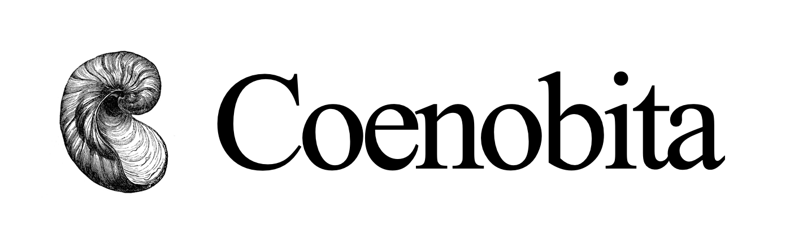

<div align="center">
  
</div>

# Coenobita

Coenobita is an extension to the Rust compiler that tracks the **integrity** and **provenance** of values as they flow through your program. Enforcing these properties during compilation helps Coenobita implement capability types that prevent supply chain attacks and other software vulnerabilities.

## Example
Suppose you're building an API using the [MVC](https://en.wikipedia.org/wiki/Model%E2%80%93view%E2%80%93controller) pattern and wish to ensure that only properly authenticated users create `Product` records. You can use Coenobita's integrity and provenance attributes to implement this restriction without impacting performance.

```rs
impl Product {
    ...
    #[cnbt::provenance(fn((auth, *),    ...) -> {*}{*})]
    #[cnbt::integrity( fn({auth}{auth}, ...) -> {*}{*})]
    pub fn create(user: User, ...) -> Result<Product> {
        // Some code goes here
    }
    ...
}
```

What does this mean?
* The `integrity` attribute indicates that only the `auth` crate is allowed to contribute to the argument, directly or otherwise
* The `provenance` attribute indicates that the argument must have been created in the `auth` crate, but we don't care which crate held it last

Using these attributes, we have turned the user into a _capability_ because a crate can only create a product if it holds an authenticated user.

## Requirements
Coenobita requires Nightly Rust. This project was last built successfully using **1.83.0-nightly** on an **Apple M1 Pro** device running **macOS Monterey 12.5.1**. If you cannot build Coenobita on your machine, please consider opening an issue.

## Installing Coenobita
First, you will need to install Coenobita on your machine.

#### Manually Install Coenobita
1. Install Rust and Cargo (`curl --proto '=https' --tlsv1.2 -sSf https://sh.rustup.rs | sh`)
2. Install Nightly (`rustup default nightly`)
3. Run `rustup component add rustc-dev` so Coenobita can access compiler internals
4. Enter the root directory and run `./install.sh`

**Note:** After trying the code, you can optionally switch from nightly back to stable with `rustup default stable`.

#### Install Coenobita Using Cargo
Note that this currently **does not work** because Coenobita hasn't been published yet.
1. Run `cargo install coenobita`

## Using Coenobita
These instructions assume you have already created a Rust project.

1. Create a folder called `.cargo` in the root directory of your project
2. Create a file called `config.toml` inside the new `.cargo` directory
3. Copy and paste the code below into the file you just created

```toml
[build]
rustc-wrapper = "coenobita"
```

You should be good to go! Please check out the `tests` directory for some examples.

### Setting Up VSCode

Coenobita _mostly_ works with VS Code and Rust Analyzer. At the moment, you may not be able to inspect standard library constructs because we inject our own capability safe version of the standard library. A quick fix is to add `std` as a dependency to your project's `Cargo.toml` as follows.

However, you must remove the dependency before trying to check, build, or test!

```toml
[dependencies]
std = { path = "<path to coenobita>/library/std" }
```

## Testing Coenobita

Coenobita is very fragile and needs to handle many edge cases. To make sure we don't accidentally break anything while working on Coenobita, we set up [UI](https://rustc-dev-guide.rust-lang.org/tests/ui.html) tests using `trybuild`. To run these tests...

1. Open the `tests/a` directory
2. Run `cargo test`

Here's a snippet of the output you should see. For more information, please check out the README file in the `tests` folder.

```
test tests/integrity/fail/closure/closure.0.rs [should fail to compile] ... ok
test tests/integrity/fail/closure/closure.1.rs [should fail to compile] ... ok
...
test tests/integrity/pass/struct/struct.2.rs [should pass] ... ok
test tests/integrity/pass/struct/struct.3.rs [should pass] ... ok
```
